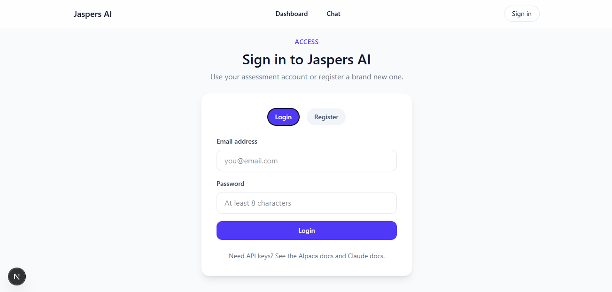
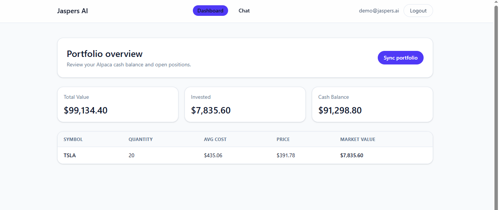
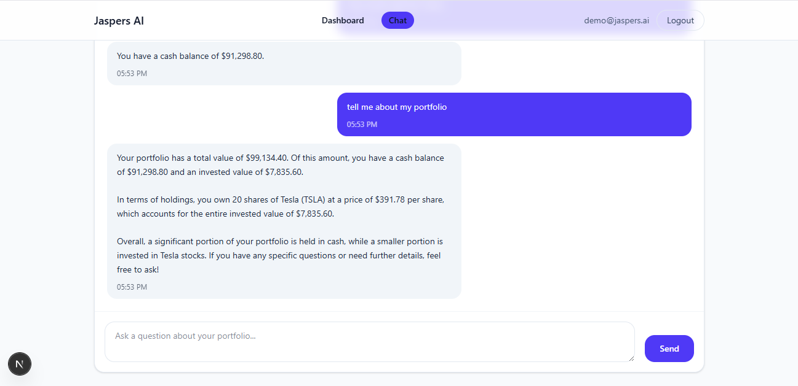

## Jaspers AI – Portfolio Chat MVP

A minimal full-stack assessment that demonstrates user authentication, Alpaca portfolio ingestion, and an AI-powered chat assistant. The project consists of a NestJS backend and a Next.js frontend.

### Project Layout

```
.
├── backend/   # NestJS API + Prisma + PostgreSQL
├── frontend/  # Next.js 16 app router UI
└── docker-compose.yaml  # Local Postgres helper
```

### Prerequisites

- Node.js 20+
- pnpm 9+
- Docker (only required if you want to spin up the local Postgres instance quickly)
- PostgreSQL 15+
- Alpaca + Anthropic/OpenAI API keys (optional – mock data is used if keys are missing)

### Quick Start

1. **Start PostgreSQL**

   ```bash
   docker compose up -d postgres
   ```

2. **Backend**

   ```bash
   cd backend
   cp env.example .env      # update the values
   pnpm install
   pnpm prisma migrate dev  # creates tables defined in prisma/schema.prisma
   pnpm db:seed # Add demo account
   pnpm start:dev           # http://localhost:3000/api
   ```

3. **Frontend**

   ```bash
   cd frontend
   cp env.example .env.local   # optional – defaults to http://localhost:3000/api
   pnpm install
   pnpm dev                    # http://localhost:3001
   ```

### Key Features

- Email/password auth with JWT + bcrypt
- Protected NestJS endpoints for portfolio and chat
- Prisma schema + migrations for the required tables
- Alpaca API integration with manual sync support (falls back to mock data if keys are missing)
- Chat endpoint that calls Claude/OpenAI when keys are provided (and a deterministic fallback otherwise)
- React dashboard & chat UI that consumes the backend APIs

More detailed instructions for each app live inside `backend/README.md` and `frontend/README.md`.

### Screenshots

Authentication screen:


Dashboard:


Chat screen:
